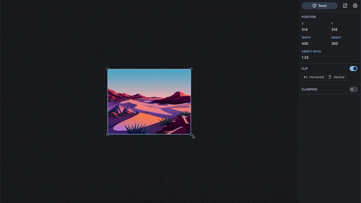
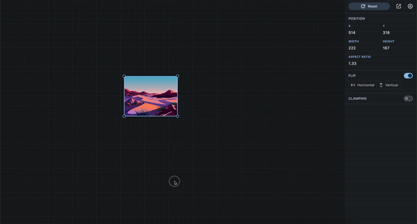

# Rect Resizer

Rect Resizer is a pure-Dart base package that allows you to programmatically handle box resizing and dragging without
relying on Flutter. It provides highly flexible, programmatically resizable and draggable boxes that can be used in any
Dart project.

## Models

Rect Resizer defines several models to mimic that of Flutter's.

* The equivalent of `Size` is `Dimension`.
* The equivalent of `Offset` is `Vector2` from the `vector_math` package.
* The equivalent of `Rect` is `Box`.
* The equivalent of `BoxConstraints` is `Constraints`.

The APIs are very similar to Flutter's, so you should be able to pick it up quickly or be able to reference
Flutter's documentation for more information.

## Resizing

Resizing is done by using the static resize function from the RectResizer dart class. It takes in several parameters:

`initialBox`: An immutable `Box` object representing the original size and position of the box before resizing.
`initialLocalPosition`: A Vector2 object representing the initial position of the mouse cursor relative to the box.
`localPosition`: A `Vector2` object representing the current position of the mouse cursor relative to the box.
`handle`: A `HandlePosition` object representing the handle that is being used to resize the box.
`resizeMode`: A `ResizeMode` object representing the mode in which the box is being resized.
`initialFlip`: A `Flip` object representing the initial state of the box.
`clampingBox`: A `Box` object representing the bounds within which the box can be resized.
`constraints`: A `Constraints` object representing the constraints that limit the minimum and maximum size of the box.

The function returns a `ResizeResult` object that contains information about the resized box.

Internally, the function calculates the difference between the initial position of the mouse cursor and the current
position, and uses this delta to resize the box according to the specified resizing mode and handle position.

The resulting box is then checked to ensure that it falls within the specified bounds and constraints.

If the resizing reaches a minimum or maximum width or height, the function sets flags in the ResizeResult object to
indicate that these limits have been reached.

## ResizeModes

The ResizeMode enum represents different types of resizing modes that can be used to determine how the rectangle should
be resized. The modes available are:

# ResizeMode.freeform

This is the default mode where the rectangle can be resized freely without any constraints. This mode is usually used
when no modifier keys are pressed.

## ResizeMode.scale

This mode is similar to ResizeMode.freeform, but it preserves the aspect ratio of the rectangle.
This means that if you resize the rectangle from the right edge, it will also resize from the left edge, but the aspect
ratio will be preserved. This mode is usually activated when the SHIFT key is pressed.

## ResizeMode.symmetric

This mode is similar to `ResizeMode.freeform`, but it is symmetric with respect to the center
of the rectangle. This means that if you resize the rectangle from the right edge, it will also resize from the left
edge. This mode is useful when you want to resize the rectangle from the center. This mode is usually activated when
the ALT key is pressed.

## ResizeMode.symmetricScale

This mode is similar to ResizeMode.scale, but it is symmetric with respect to the center
of the rectangle. This means that if you resize the rectangle from the bottom-right corner, it will also resize from the
top-left corner while preserving the aspect ratio. This mode is usually activated when both the ALT and SHIFT keys are
pressed.
